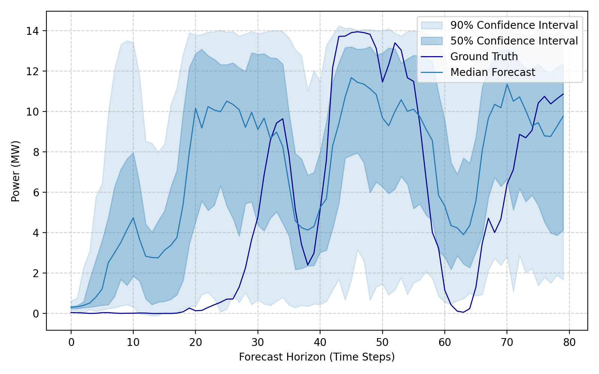

<div align="center">
  <h2><b>WindFM: An Open-Source Foundation Model for Zero-Shot Wind Power Forecasting</b></h2>
</div>

<div align="center">

<a href="https://huggingface.co/NeoQuasar"> 
 
</a> 
<a href="https://github.com/shiyu-coder/WindFM/graphs/commit-activity"> 
 
</a> 
<a href="https://github.com/shiyu-coder/WindFM/stargazers"> 
 
</a> 
<a href="https://github.com/shiyu-coder/WindFM/network/members"> 
 
</a> 
<a href="./LICENSE"> 
 
</a>

</div>

> **WindFM** is the first open-source foundation model designed for wind power forecasting. Pre-trained on a massive dataset of **~150 billion time steps** from **126,000 sites**, it learns a universal representation of wind generation dynamics to deliver state-of-the-art **zero-shot** wind power predictions.

## 📰 News
*   🚩 **[2025.9.8]** Our paper is now available on [arXiv](https://arxiv.org/abs/2509.06311)!
*   🚩 **[2025.9.5]** We have released the pre-trained WindFM [model](https://huggingface.co/NeoQuasar/WindFM) and [tokenizer](https://huggingface.co/NeoQuasar/WindFM-Tokenizer) on HuggingFace!

## ✨ Why WindFM?

Existing forecasting methods often force a trade-off: either train a highly specialized model for each site (which is costly and doesn't scale) or adapt a large, general-purpose model (which can be inefficient and lack domain knowledge). WindFM offers a new paradigm with distinct advantages:

*   🌍 **Universal Representation**: Instead of learning site-specific patterns, WindFM is pre-trained on a vast and diverse dataset, enabling it to capture the fundamental physics and meteorological patterns governing wind power generation across different geographies and turbine types.

*   💡 **Lightweight and Efficient**: With only **8.1M parameters**, WindFM is a compact model that is easy to deploy in operational environments. It demonstrates that a domain-specific focus can achieve superior performance without the massive scale of general-purpose foundation models.

*   🚀 **Powerful Zero-Shot Performance**: The core strength of WindFM is its ability to provide high-quality deterministic and probabilistic forecasts for unseen wind farms. This eliminates the need for site-specific data collection and model training, simplifying the deployment process.

*   💪 **Robust and Transferable**: Our experiments show that WindFM maintains strong performance even on out-of-distribution data from a different continent, proving the robustness and transferability of its learned representations.

## 🔧 How It Works: A Discretize-and-Generate Framework

WindFM leverages a generative approach inspired by Large Language Models:

1.  **Specialized Tokenizer**: A custom time-series tokenizer first converts continuous multivariate inputs (wind speed, direction, temperature, power, etc.) into a sequence of discrete, hierarchical tokens.
2.  **Decoder-only Transformer**: A Transformer-based model then learns the underlying dynamics of these token sequences through autoregressive pre-training. By learning to predict the "next token", it implicitly builds a deep, generative model of wind power dynamics.


## 🚀 Quick Start

Getting started with WindFM is simple. The following guide walks you through loading the model and generating a probabilistic forecast in just a few lines of code.

### 1. Installation

First, clone the repository and install the required dependencies.

```shell
git clone https://github.com/shiyu-coder/WindFM.git
cd WindFM
pip install -r requirements.txt
```

### 2. Making a Zero-Shot Forecast

The `WindFMPredictor` class provides a high-level API for easy inference. The entire process, from loading the model to generating predictions, is shown below.

```python
import pandas as pd
import numpy as np
import matplotlib.pyplot as plt
from model import WindFM, WindFMTokenizer, WindFMPredictor

# === Step 1: Load the Pre-trained Model and Tokenizer ===
# Models are downloaded automatically from the Hugging Face Hub.
tokenizer = WindFMTokenizer.from_pretrained("shiyu-coder/WindFM-Tokenizer")
model = WindFM.from_pretrained("shiyu-coder/WindFM-8.1M")

# === Step 2: Initialize the Predictor ===
# The predictor handles data normalization, tokenization, and generation.
# Use a GPU for faster inference if available.
predictor = WindFMPredictor(model, tokenizer, device="cuda:0", max_context=1024)

# === Step 3: Prepare Your Data ===
# Load your own time series data. The dataframe must contain a 'power' column
# and the relevant weather features.

# ---------------------------------------------------------------------------------
# >> A Note on Timestamps (UTC is Required) <<
#
# To maintain temporal consistency and correctly interpret time-dependent 
# patterns (like diurnal cycles) across different geographical locations, all 
# timestamp data fed into the model must be in Coordinated Universal Time (UTC).
#
# During pre-training, all time information was standardized to UTC. Using a single,
# unified timezone prevents ambiguity and is critical for the model's performance.
# ---------------------------------------------------------------------------------
df = pd.read_csv("./data/sample_wind_farm_data.csv")
df['time'] = pd.to_datetime(df['time'], utc=True)

# Define the historical context and the forecast horizon
lookback = 240
pred_len = 80

# The model uses these features as input. 'power' must be included.
input_features = ['wind_speed', 'wind_direction', 'power', 'density', 'temperature', 'pressure']

# Slice the data for model input (x) and define future timestamps (y)
x_df = df.loc[:lookback-1, input_features]
x_timestamp = df.loc[:lookback-1, 'time']
y_timestamp = df.loc[lookback:lookback+pred_len-1, 'time']

# === Step 4: Generate Probabilistic Forecasts ===
# Use `sample_count` to generate multiple future scenarios.
pred_samples_df = predictor.predict(
    df=x_df,
    x_timestamp=x_timestamp,
    y_timestamp=y_timestamp,
    pred_len=pred_len,
    sample_count=100  # Number of samples for probabilistic forecast
)

print("Shape of the prediction samples DataFrame:", pred_samples_df.shape)
print("Prediction samples head:")
print(pred_samples_df.head())

# === Step 5: Visualize the Results ===
# The output is a DataFrame of raw sample paths. You can use these to
# calculate any statistics (mean, median, quantiles) for visualization.

# Get the ground truth for the prediction period
ground_truth = df.loc[lookback:lookback+pred_len-1, 'power'].values

# Calculate quantiles from the prediction samples
q50 = pred_samples_df.quantile(0.5, axis=1)
q90 = pred_samples_df.quantile(0.9, axis=1)
q10 = pred_samples_df.quantile(0.1, axis=1)

# Plotting
plt.figure(figsize=(10, 6))
plt.plot(ground_truth, color="black", label="Ground Truth")
plt.plot(q50, color="tomato", label="Median Forecast (p50)")
plt.fill_between(
    np.arange(pred_len), q10, q90, color="tomato", alpha=0.3, label="80% Confidence Interval (p10-p90)"
)
plt.xlabel("Forecast Horizon (Time Steps)")
plt.ylabel("Normalized Power")
plt.legend()
plt.grid(True, linestyle='--', alpha=0.6)
plt.show()
```

### 3. Example and Visualization

A complete, runnable script with data loading and plotting is available in [`examples/prediction_example.py`](examples/prediction_example.py). Running it will produce a visualization comparing the ground truth with the model's probabilistic forecast.

<p align="center">
    
</p>

## 📖 Citation

If you find WindFM useful in your research, we kindly ask that you cite our [paper](https://arxiv.org/abs/2509.06311). 

```
@misc{fan2025windfm,
      title={WindFM: An Open-Source Foundation Model for Zero-Shot Wind Power Forecasting}, 
      author={Hang Fan and Yu Shi and Zongliang Fu and Shuo Chen and Wei Wei and Wei Xu and Jian Li},
      year={2025},
      eprint={2509.06311},
      archivePrefix={arXiv},
      primaryClass={cs.LG},
      url={https://arxiv.org/abs/2509.06311}, 
}
```

## 📜 License
This project is licensed under the [MIT License](./LICENSE).